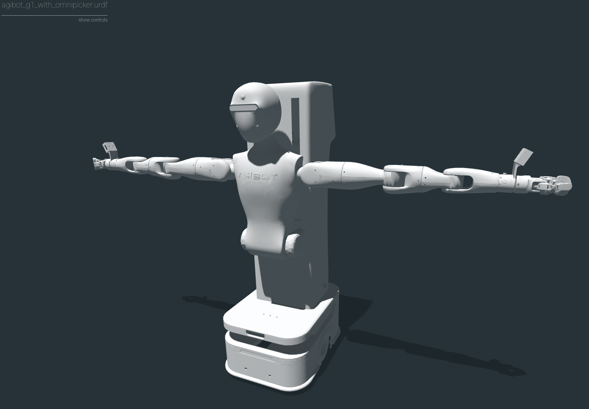
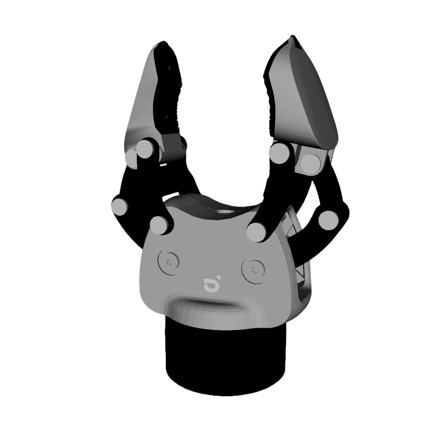

# Robot Descriptions

This repository contains the URDF files for manipulation robots, all organized as ROS2 packages.

## Quick Start
```
# Clone the repository
git clone https://github.com/msra-sim/robot_descriptions
```

## Available URDFs

| Robot | Image | Path |
|-------|-------|------|
| Agibot G1 with Omni-Picker (Assembled) |  | [agibot_g1_with_gripper_description](manipulation/Agibot/agibot_g1_with_gripper_description) |
| Agibot G1 with 120S | TBD | [agibot_g1_with_gripper_description](manipulation/Agibot/agibot_g1_with_gripper_description) |
| Omni-Picker Gripper |  | [agibot_omni_description](manipulation/Agibot/agibot_omni_description) |